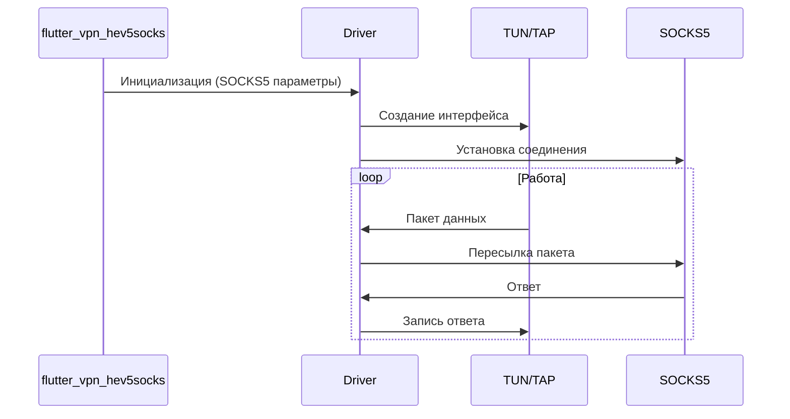

# 🚀 flutter_vpn_hev5socks

Cross-platform VPN client driver leveraging TUN/TAP devices and SOCKS5 protocol for seamless, secure, and performant network communication across Android, iOS, Windows, Linux, and macOS.

## 🏗️ Architecture Overview



## Quick Start 🏁

### Clone and Build

```bash
git clone https://github.com/VPNclient/flutter_vpn_hev5socks.git
cd flutter_vpn_hev5socks
mkdir build

# Static library
make static

# Shared library
make shared
```

## 🤝 Contributing
We welcome contributions! Please fork the repository and submit pull requests.

## 📜 License

This project is licensed under the **VPNclient Extended GNU General Public License v3 (GPL v3)**. See [LICENSE.md](LICENSE.md) for details.

⚠️ **Note:** By using this software, you agree to comply with additional conditions outlined in the [VPNсlient Extended GNU General Public License v3 (GPL v3)](LICENSE.md)

## 💬 Support
For issues or questions, please open an issue on our GitHub repository.
